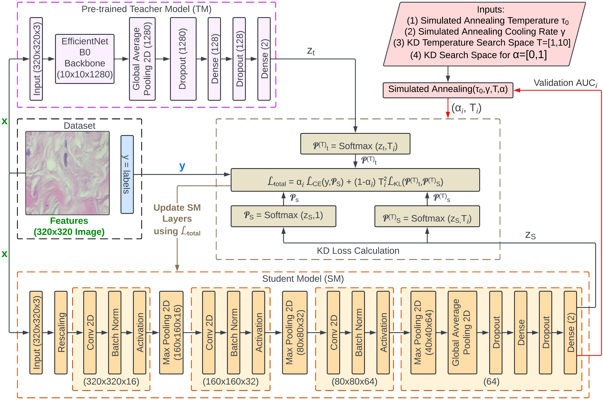

# SA-KD for Lightweight Breast Cancer Detection

Official implementation of:

**Resource-Efficient Knowledge Distillation via Simulated Annealing for Lightweight Breast Cancer Detection**

**Authors:** Falmata Modu, Rajesh Prasad, and Farouq Aliyu

Accepted at **AFRICAI @ MICCAI 2026**.

## Overview

This repository contains the implementation of a simulated annealing (SA)-based strategy for optimizing knowledge distillation (KD) hyperparameters for lightweight breast cancer histopathology classification.

The framework distills knowledge from an ImageNet-pretrained EfficientNetB0 teacher into a lightweight CNN student. Simulated annealing automatically optimizes the KD loss-balancing coefficient alpha and distillation temperature T using validation AUC as the optimization objective.

The KD objective is:

```text
L_total = alpha * L_CE + (1 - alpha) * T^2 * L_KL
```

The method is evaluated on the 400x magnification subset of the BreakHis dataset for binary benign-versus-malignant classification.

<p align="center">
  
</p>

<p align="center">
  <b>Overview of the proposed SA-optimized knowledge distillation framework.</b>
</p>

## Repository Structure

```text
SA-KD-BreastCancer/
├── README.md
├── requirements.txt
├── .gitignore
├── configs/
│   └── config.py
└── src/
    ├── data.py
    ├── models.py
    ├── train_teacher.py
    ├── train_student.py
    ├── distillation.py
    ├── simulated_annealing.py
    ├── search_baselines.py
    └── evaluate.py
```

## Dataset

Experiments use the **BreakHis 400x** breast histopathology dataset.

The dataset is publicly available and is not redistributed in this repository.

**Dataset source:**  
https://www.kaggle.com/datasets/forderation/breakhis-400x

The experiments use a pre-split version containing:

- 1,148 training images
- 545 test images
- 10% of the training set held out for validation

Images are RGB and resized to 320 x 320 pixels.

### Expected Directory Structure

After downloading the dataset, organize it as:

```text
data/
├── train/
│   ├── benign/
│   └── malignant/
└── test/
    ├── benign/
    └── malignant/
```

The `data/` directory is excluded from Git version control.

## Installation

Clone this repository:

```bash
git clone https://github.com/falmatamkn/SA-KD-BreastCancer.git
cd SA-KD-BreastCancer
```

Install the required packages:

```bash
pip install -r requirements.txt
```

## Models

### Teacher

The teacher is an ImageNet-pretrained EfficientNetB0 model fine-tuned on BreakHis.

The EfficientNetB0 backbone is initially frozen. During fine-tuning, the top portion of the backbone is unfrozen and the optimizer is re-created for stability.

The teacher contains approximately **3.24 million trainable parameters**.

### Lightweight Student

The student is a lightweight CNN designed for deployment in resource-constrained environments.

It consists of three convolutional blocks followed by global average pooling and a compact classification head.

The student contains approximately **28K trainable parameters**, corresponding to approximately a **116x reduction** relative to the teacher.

The same student architecture is also trained directly using ground-truth labels without KD to provide the supervised baseline and initialization for the KD experiments.

## Knowledge Distillation

Logits-based knowledge distillation is used to transfer knowledge from the EfficientNetB0 teacher to the lightweight student.

Pre-softmax teacher and student logits are used for distillation.

The KD objective combines supervised cross-entropy loss and KL-divergence-based distillation loss:

```text
L_total = alpha * L_CE + (1 - alpha) * T^2 * L_KL
```

where:

- `alpha` controls the balance between hard-label and soft-label supervision.
- `T` is the distillation temperature.

The hyperparameter search space is:

```text
alpha: [0, 1]
T:     [1, 10]
```

Each candidate `(alpha, T)` configuration is evaluated by training the KD student for **5 epochs** and measuring validation AUC.

## Simulated Annealing

Simulated annealing is used to automatically optimize `alpha` and `T`.

The SA settings are:

```text
Initial annealing temperature: 1000
Cooling rate:                  0.95
Minimum temperature:           1e-8
Maximum evaluations:           30
Early-stopping patience:       10 evaluations
```

Three SA proposal configurations are evaluated.

### Full Search (FS)

At each iteration, a candidate is sampled over the full hyperparameter search space:

```text
alpha ∈ [0, 1]
T     ∈ [1, 10]
```

### Small Move (SM)

Local candidates are generated using:

```text
delta_alpha = 0.01
delta_T     = 0.10
```

### Big Move (BM)

Local candidates are generated using:

```text
delta_alpha = 0.05
delta_T     = 0.50
```

The experiments are repeated using three random seeds:

```text
42, 50, 100
```

Validation AUC is used as the optimization objective. The held-out test set is not used during hyperparameter optimization.

## Alternative Search Strategies

The proposed SA strategy is compared with:

- Fixed hyperparameters
- Random search
- Coarse grid search

Random search and grid search use the same **30-evaluation tuning budget** as SA.

The fixed hyperparameter values are not specified here because the corresponding `(alpha, T)` values were not reported in the manuscript.

## Reported Results

### SA Configuration Comparison

| Configuration | Mean Test AUC | Standard Deviation |
|---|---:|---:|
| Full Search (FS) | 0.9837 | 0.0011 |
| Small Move (SM) | 0.9777 | 0.0034 |
| Big Move (BM) | 0.9733 | 0.0024 |

The highest individual test AUC of **0.9848** is obtained using Full Search.

### Hyperparameter Search Comparison

| Method | Budget | Test AUC | Accuracy (%) | F1 (%) |
|---|---:|---:|---:|---:|
| Fixed | 1 | 0.9693 | 90.83 | 93.19 |
| Random Search | 30 | 0.9810 | 91.74 | 93.79 |
| Grid Search | 30 | 0.9826 | 92.66 | 94.62 |
| **SA (Ours)** | **30** | **0.9848** | **93.39** | **95.14** |

The EfficientNetB0 teacher achieves a test AUC of **0.9858**, while the best SA-tuned lightweight student achieves a test AUC of **0.9848**.

## Evaluation

ROC-AUC is calculated from continuous positive-class probabilities.

The following classification metrics are calculated using a fixed decision threshold of `0.5`:

- Accuracy
- F1-score
- Precision
- Recall / Sensitivity
- Specificity
- Confusion matrix

The test set is reserved exclusively for final evaluation and is not used for hyperparameter selection.

## Reproducibility

The implementation follows the experimental setup described in the paper:

- BreakHis 400x magnification
- RGB input images resized to 320 x 320
- Batch size of 16
- 10% validation holdout from the training set
- EfficientNetB0 teacher
- Lightweight CNN student
- Logits-based knowledge distillation
- Validation AUC as the hyperparameter optimization objective
- 30-evaluation search budget
- Seeds 42, 50, and 100
- Held-out test set used only for final evaluation

## Dataset and Model Weights

The BreakHis dataset is **not distributed** with this repository. Please download it from the public dataset source provided above.

Pretrained teacher and student model weights are also **not currently distributed** with this repository.

The repository provides the architectures, training procedures, knowledge-distillation implementation, hyperparameter search methods, and evaluation code required to reproduce the experimental workflow.

## Acknowledgments

This work was supported by Google through the Google PhD Fellowship Program and the Applied Research Center for Nonprofit and Social Development (ARC-NSD) at King Fahd University of Petroleum & Minerals (KFUPM).

## Citation

If you find our work useful in your research or use parts of this code, please cite our paper.

The final Springer LNCS volume and page information will be updated after publication.

```bibtex
@InProceedings{Modu_SAKD_MICCAI2026,
    author    = {Modu, Falmata and Prasad, Rajesh and Aliyu, Farouq},
    title     = {Resource-Efficient Knowledge Distillation via Simulated Annealing for Lightweight Breast Cancer Detection},
    booktitle = {Proceedings of Medical Image Computing and Computer Assisted Intervention -- MICCAI 2026 Workshops},
    year      = {2026},
    publisher = {Springer Nature Switzerland},
    volume    = {LNCS, to appear},
    month     = {September},
    pages     = {to appear}
}
```

**Note:** The BibTeX entry above is provisional. The LNCS volume, page range, and final proceedings metadata will be updated once the paper is published online.
